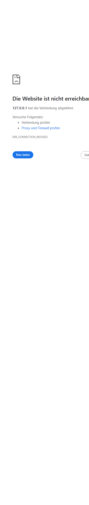

# Deutsch Voice Coach

A voice-first AI prototype for practicing spoken German with pronunciation-focused feedback.

This project was built as a personal language-learning assistant: not just to correct text, but to listen, react, score pronunciation, simulate work conversations, and coach smoother, more natural speech.

## Screenshots

### Desktop


### Mobile



## Features

- `Live voice turns` with short push-to-talk interaction
- `Accent score` for recorded phrases
- `Meeting simulation` for workplace German practice
- `Pronunciation coaching` with stress, length, and flow tips
- `Practice drill generation` for targeted speaking exercises
- `ChatGPT-style UI` with voice playback in the browser

## Demo Flow

1. Choose a mode: `Live Conversation`, `Accent Score`, or `Meeting Simulation`
2. Record a short spoken turn or phrase
3. Get feedback on pronunciation, rhythm, and clarity
4. Generate new drills and repeat with fresh examples

## Tech Stack

- `Node.js`
- `Express`
- `Groq Speech-to-Text`
- `Groq Chat Completions`
- Browser `MediaRecorder`
- Browser `SpeechSynthesis`
- Vanilla HTML, CSS, and JavaScript

## Project Structure

```text
.
|-- public/
|   |-- app.js
|   |-- index.html
|   `-- styles.css
|-- .env.example
|-- package.json
|-- package-lock.json
|-- README.md
`-- server.js
```

## Getting Started

### 1. Install dependencies

```bash
npm install
```

### 2. Create your environment file

Create a `.env` file in the project root:

```env
GROQ_API_KEY=gsk_your_key_here
PORT=3000
```

You can also copy [`.env.example`](./.env.example) and fill in your key.

### 3. Start the app

```bash
npm run dev
```

### 4. Open it in the browser

```text
http://localhost:3000
```

## How It Works

### Live Conversation

The browser records a short spoken turn and sends it to the backend.

The backend then:

1. transcribes the audio with Groq Whisper
2. sends the transcript and chat history to a language model
3. returns a short German coaching reply

The browser plays the answer using the local speech engine when a German voice is available.

### Accent Score

For a recorded phrase, the app:

1. transcribes the learner audio
2. compares it with the target sentence
3. requests structured pronunciation feedback

The returned report includes:

- a score from `0` to `100`
- the recognized transcript
- a corrected sentence
- a smoothness tip
- sound or word fragments to stretch or sharpen
- drill words for repetition

### Meeting Simulation

In meeting mode, the assistant acts like a colleague or manager and keeps the conversation going while still correcting pronunciation.

This makes the app useful for:

- standups
- project updates
- introductions
- workplace small talk
- manager conversations

## Current Limitations

- This is `turn-based voice`, not full duplex realtime streaming
- Accent scoring is `heuristic`, not phoneme-level acoustic analysis
- German playback depends on the browser or operating system having a `de-DE` voice
- Groq currently does not provide the same browser realtime voice flow as OpenAI Realtime

## Why This Project Exists

Most language apps help with vocabulary or grammar.

This one focuses on a harder problem: speaking German more naturally.

The goal is to help a learner notice:

- where a vowel should be longer
- where stress falls in a word
- where speech sounds too hard or too flat
- how to connect words more smoothly in real conversation

## Roadmap

- better phonetic feedback
- saved session history
- learner progress tracking
- stronger workplace simulation scenarios
- cleaner TTS support for German
- more detailed speaking analytics

## Scripts

```bash
npm run dev
npm start
```

## Security Note

Do not commit your real `.env` file or API keys.

This repository already ignores:

- `.env`
- `node_modules/`

## License

This project currently has no license file. Add one before public reuse or distribution.
